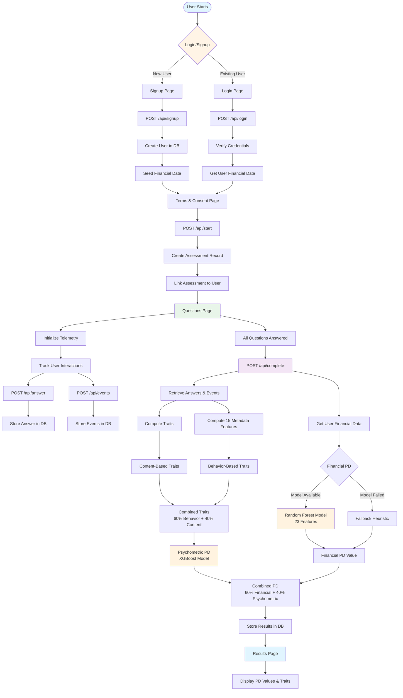
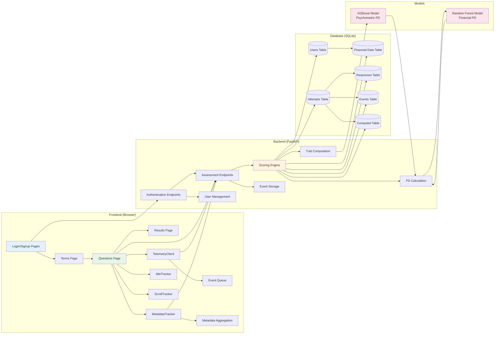
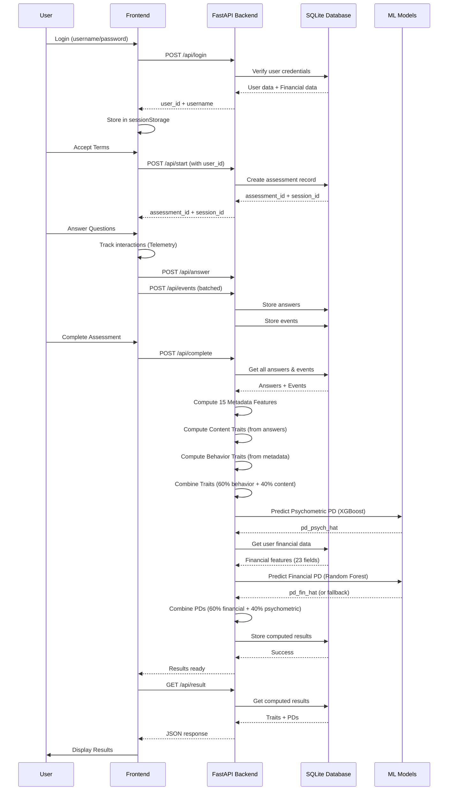
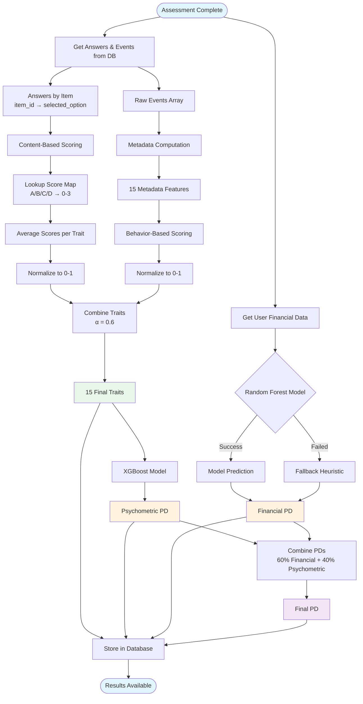
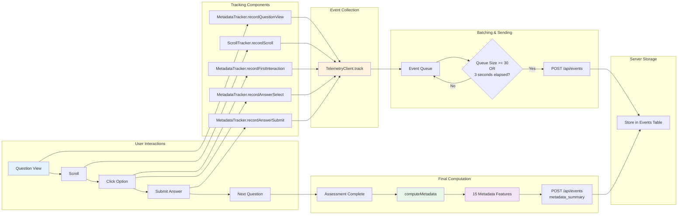
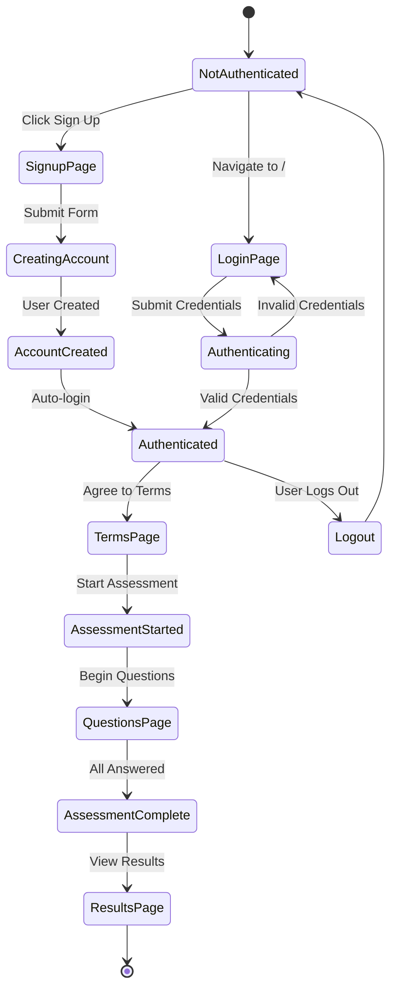
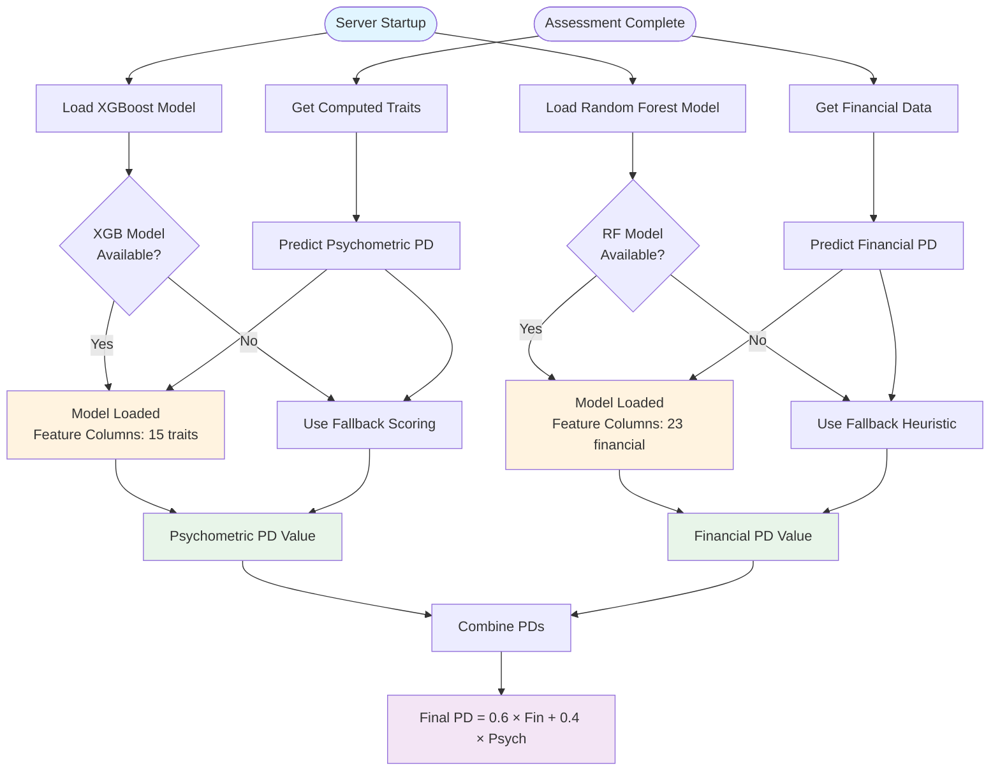
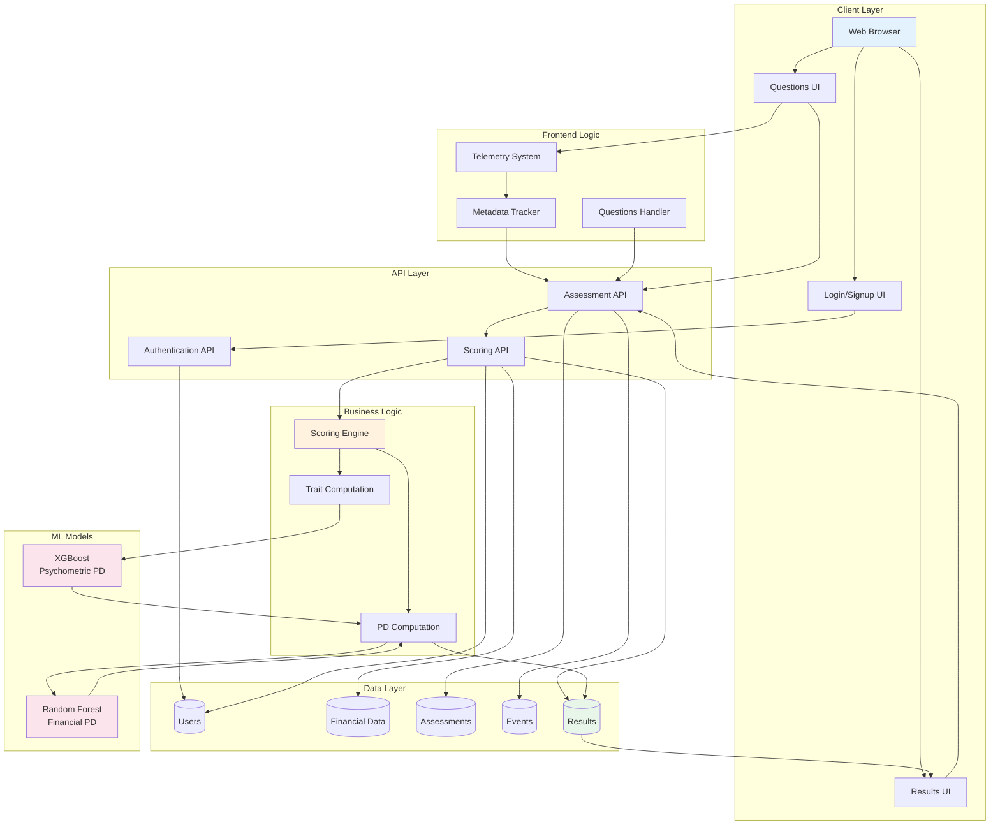

# FrankScore System Architecture

## Complete System Workflow



## Component Architecture



## Data Flow Diagram



## Database Schema

```mermaid
erDiagram
    USERS ||--o{ ATTEMPTS : "has"
    USERS ||--|| FINANCIAL_DATA : "has"
    ATTEMPTS ||--o{ RESPONSES : "contains"
    ATTEMPTS ||--o{ EVENTS : "contains"
    ATTEMPTS ||--o| COMPUTED : "produces"
    
    USERS {
        int id PK
        string username UK
        string password_hash
        string email
        int created_at_ms
        int last_login_ms
    }
    
    FINANCIAL_DATA {
        int user_id PK,FK
        string customer_id
        float num_previous_loans
        float Total_Amount
        float daily_burden
        float burden_ratio
        float borrower_history_strength
        ... 23 features total
    }
    
    ATTEMPTS {
        string assessment_id PK
        int user_id FK
        string session_id
        string status
        int started_at_ms
        int completed_at_ms
    }
    
    RESPONSES {
        int id PK
        string assessment_id FK
        string item_id
        string selected_option
        int answered_at_ms
    }
    
    EVENTS {
        int id PK
        string assessment_id FK
        string session_id
        string event_name
        int client_ts_ms
        float perf_ts_ms
        string item_id
        int seq
        string payload_json
    }
    
    COMPUTED {
        int id PK
        string assessment_id FK,UK
        string metadata_json
        string traits_json
        float pd_psych_hat
        float pd_fin_hat
        float pd_final_hat
    }
```

## Scoring Pipeline



## Telemetry Tracking Flow



## Authentication & Authorization Flow



## Model Integration Flow



## Complete System Overview



